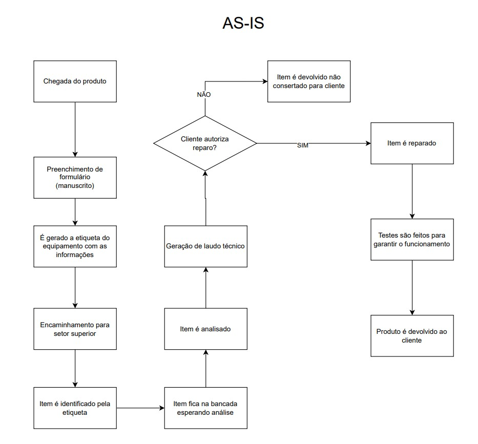

# Dores e Justificativas

# O que é o projeto?

O projeto será desenvolvido com o objetivo de otimizar a logística das ordens de serviço, proporcionando maior agilidade, organização e segurança em todo o processo. O sistema incluirá diversas funcionalidades, como a centralização das informações das ordens de serviço, o armazenamento seguro desses dados em um banco de dados, juntamente com uma foto do produto, além de facilitar a consulta e a gestão dos produtos, entre outras aplicações.

# Dores Identificadas

Durante a entrevista com o CEO, foram identificadas as seguintes dores no processo atual:

## 1. Dificuldade na Rastreabilidade de Equipamentos
Há problemas em rastrear equipamentos, especialmente quando há itens similares sendo registrados ao mesmo tempo. Isso pode levar a confusão sobre a identificação correta do cliente e do equipamento.

---

## 2. Divergência de Informações
Existem riscos de registrar informações incorretas ou divergentes, como códigos de clientes ou descrições de equipamentos, especialmente quando a entrada é feita manualmente.

---

## 3. Processo de Entrada Manual e Ineficiente
O atual processo de entrada de equipamentos é manual, envolvendo o preenchimento de formulários à mão, o que é demorado e propenso a erros.

---

## 4. Risco de Exposição de Informações Confidenciais
Existe uma preocupação com a segurança das informações, especialmente no que diz respeito à exposição de dados de clientes e outras informações sensíveis.

---

## 5. Falta de Automatização na Prioridade de Equipamentos
A identificação e priorização dos equipamentos na entrada não é automatizada, o que retarda o processo de triagem e atendimento.

---

## 6. Dependência de Uma Pessoa para Realizar o Cadastro
Apenas uma pessoa é responsável por registrar os equipamentos, o que pode ser um gargalo no processo e causar atrasos.

---

## 7. Limitação da Infraestrutura de Internet
A internet instável no local de recepção limita a possibilidade de uso de uma aplicação totalmente web, o que pode comprometer a eficiência do sistema.

---

## 8. Ausência de Automação na Geração de Documentos e Etiquetas
Atualmente, a geração de etiquetas e recibos é manual, o que poderia ser automatizado para ganhar tempo e reduzir erros.

Essas dores revelam a necessidade de uma solução que automatize e agilize processos, garantindo precisão na entrada e rastreamento de equipamentos, além de proteger informações sensíveis.

---

# AS-IS

