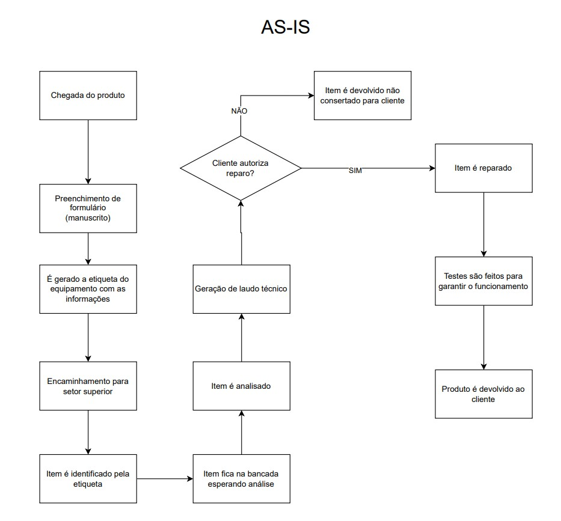

# O que é o projeto?

O projeto será desenvolvido com o objetivo de otimizar a logística das ordens de serviço, proporcionando maior agilidade, organização e segurança em todo o processo.

O sistema incluirá diversas funcionalidades, como a centralização das informações das ordens de serviço, o armazenamento seguro desses dados em um banco de dados, juntamente com uma foto do produto, além de facilitar a consulta e a gestão dos produtos, entre outras aplicações.

# AS-IS

# Objetivos do sistema.

- *Agilidade na entrada e na discriminação do equipamento;*

- *identificação rápida de emergências do item;*

- *Um pré cadastro do equipamento na entrada, facilitando tanto a parte de processos de negociação e a  elaboração de laudo, quanto análise também de bancada.*